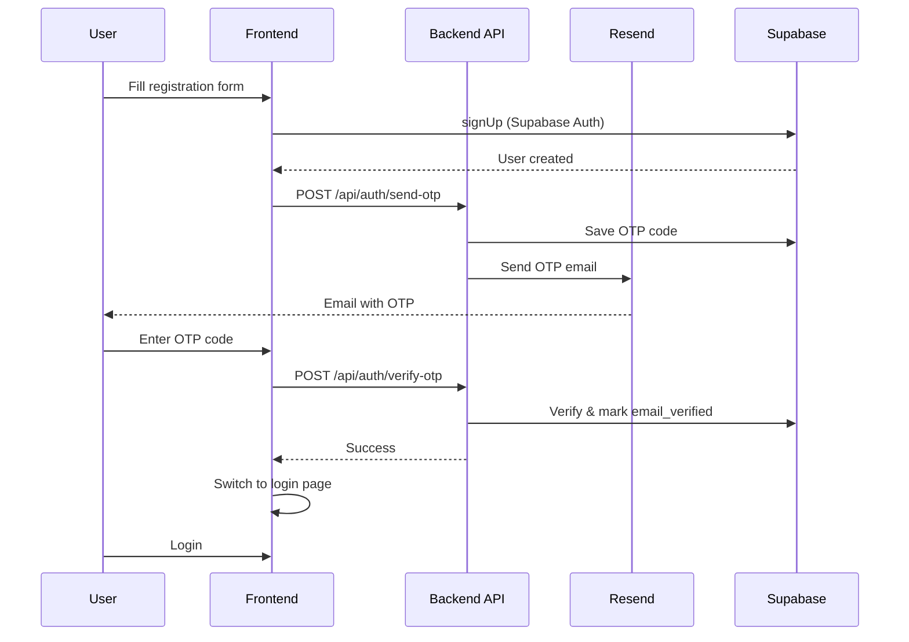

# Email OTP Verification with Resend

Implement email verification during registration using Resend for sending OTP codes. Users must verify their email before they can log in.

## Prerequisites

> [!IMPORTANT]
> **Resend Configuration Required**: 
> 1. Create account at [resend.com](https://resend.com)
> 2. Get your API key from Dashboard → API Keys
> 3. **Optional but Recommended**: Add and verify your custom domain (e.g., `corehub.life`) to send emails from `noreply@corehub.life` instead of the sandbox `onboarding@resend.dev`

> [!WARNING]
> **Breaking Change**: After implementation, existing users who registered before email verification was enabled will need to be marked as verified in the database, or they won't be able to log in.

---

## Proposed Changes

### Backend - Express API

#### [NEW] `apps/api/src/services/email.service.ts`

New service for sending emails via Resend:
- Initialize Resend client with API key
- `sendOTPEmail(email, code)` - Send 6-digit OTP verification email
- Beautiful HTML email template with OTP code
- Configure sender address (`noreply@corehub.life` or sandbox)

---

#### [NEW] `apps/api/src/services/otp.service.ts`

New service for OTP code management:
- `generateOTP(email)` - Create 6-digit code, save to DB with 10-min expiry
- `verifyOTP(email, code)` - Validate code, mark email as verified
- `resendOTP(email)` - Invalidate old codes, generate and send new one
- Auto-cleanup expired codes

---

#### [NEW] `apps/api/src/routes/auth.routes.ts`

New authentication routes:
```
POST /api/auth/send-otp       - Send/resend OTP to email
POST /api/auth/verify-otp     - Verify OTP code
GET  /api/auth/check-verified - Check if email is verified
```

---

#### [MODIFY] `apps/api/src/index.ts`

- Import and register new `authRouter` at `/api/auth`

---

#### [MODIFY] `apps/api/src/config/env.ts`

Add new environment variables:
- `RESEND_API_KEY` - Resend API key
- `EMAIL_FROM` - Sender email address (default: `onboarding@resend.dev`)

---

### Database - Supabase

#### [NEW] Migration: `otp_codes` table

```sql
CREATE TABLE public.otp_codes (
    id UUID PRIMARY KEY DEFAULT gen_random_uuid(),
    email TEXT NOT NULL,
    code VARCHAR(6) NOT NULL,
    expires_at TIMESTAMPTZ NOT NULL,
    verified BOOLEAN DEFAULT false,
    created_at TIMESTAMPTZ DEFAULT NOW()
);

CREATE INDEX idx_otp_codes_email ON public.otp_codes(email);
CREATE INDEX idx_otp_codes_expires_at ON public.otp_codes(expires_at);
```

#### [NEW] Migration: `email_verified` column

Add `email_verified` column to `profiles` table:

```sql
ALTER TABLE public.profiles 
ADD COLUMN IF NOT EXISTS email_verified BOOLEAN DEFAULT false;
```

---

### Frontend - React

#### [MODIFY] `apps/web/src/pages/LoginRegister.tsx`

Update registration flow:
1. After successful `signUp`, show OTP input step instead of redirecting to login
2. Add new state: `otpStep`, `otpCode`, `otpEmail`
3. Create OTP input component with 6 input boxes
4. Handle verify, resend functionality
5. Only switch to login after successful OTP verification

---

#### [MODIFY] `apps/web/src/lib/auth.ts`

Add new functions:
- `sendOTP(email)` - Call backend to send OTP
- `verifyOTP(email, code)` - Call backend to verify OTP
- `resendOTP(email)` - Call backend to resend OTP

---

#### [NEW] `apps/web/src/components/OTPInput.tsx`

Reusable 6-digit OTP input component:
- Auto-focus on mount
- Auto-advance to next input on digit entry
- Handle backspace navigation
- Paste support for full code
- Timer for resend (60 seconds cooldown)

---

## Architecture Flow



---

## Verification Plan

### Automated Tests

1. **Backend OTP Service Tests**
   - File: `apps/api/src/services/otp.service.test.ts`
   - Run: `npm run test --filter=otp`
   - Tests:
     - Generate OTP returns 6-digit code
     - Expired OTP fails verification
     - Valid OTP succeeds and marks verified
     - Resend invalidates old codes

2. **Existing Test Suite**
   - Run: `cd apps/api && npm test`
   - Ensure no regressions in existing tests

### Manual Verification

1. **Registration → OTP Flow**
   - Go to `/auth` and click "Register"
   - Enter email, password, confirm password
   - Click "Register"
   - **Expected**: OTP input screen appears
   - Check Resend dashboard or backend console for OTP code
   - Enter OTP code
   - **Expected**: "Email verified!" toast, redirects to login

2. **Invalid OTP**
   - Register with new email
   - Enter wrong OTP code (e.g., "123456")
   - **Expected**: Error message "Invalid or expired code"

3. **Resend OTP**
   - Register with new email
   - Wait for "Resend" button to be enabled (60s)
   - Click "Resend"
   - **Expected**: New OTP sent, old one invalidated

4. **Login Blocked for Unverified**
   - Register but don't verify OTP
   - Try to login with those credentials
   - **Expected**: Error "Please verify your email first"
